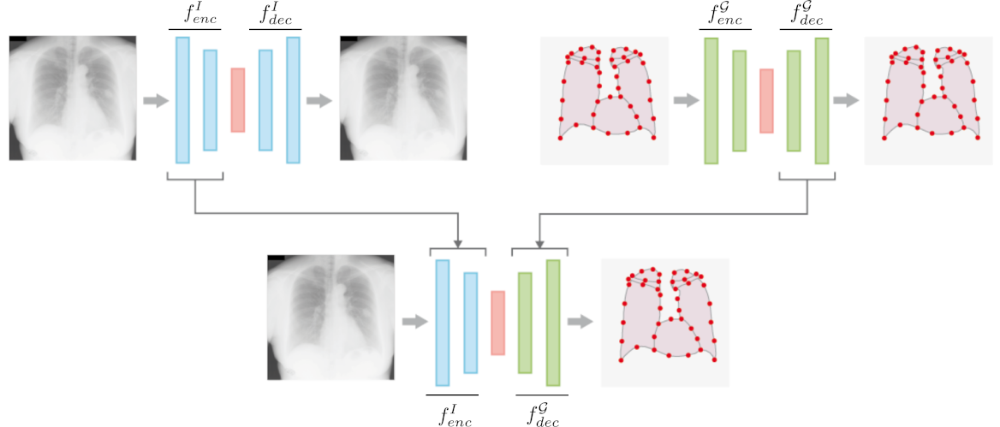

# HybridGNet: Hybrid graph convolutional neural networks for landmark-based anatomical segmentation

Nicolás Gaggion¹, Lucas Mansilla¹, Diego Milone¹, Enzo Ferrante¹

¹ Research Institute for Signals, Systems and Computational Intelligence (sinc(i)), FICH-UNL, CONICET, Ciudad Universitaria UNL, Santa Fe, Argentina.

Paper: https://link.springer.com/chapter/10.1007%2F978-3-030-87193-2_57

Video presentation: https://www.youtube.com/watch?v=NAJkpf1fk8w



### Installation:

First create the anaconda environment:

```
conda env create -f env.yml
```
Activate it with:
```
conda activate torch
```

In case the installation fails, you can build your own enviroment.

Conda dependencies: \
-PyTorch 1.10.0 \
-Torchvision \
-PyTorch Geometric \
-Scipy \
-Numpy \
-Pandas  \
-Scikit-learn \
-Scikit-image 

Pip dependencies: \
-medpy==0.4.0 \
-opencv-python==4.5.4.60 

### Datasets:

Download the datasets from the official sources (check Datasets/readme.txt) and run the corresponding preprocessing scripts.

### Paper reproducibility:

Download the weights from here: https://drive.google.com/drive/folders/1YcmT8JzdtNuaWVqhv8Zfm00lF47w0eU5

For more information about the MultiAtlas baseline, check Lucas Mansilla's repository:
https://github.com/lucasmansilla/Multi-Atlas_RCA